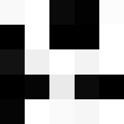

# Backtracking Algorithm

[](_presentation/main.pptx)
[](_presentation/handout.docx)
[](_presentation/sources.docx)

Final oral exam for the german `Abitur` about the backtracking algorithm (implemented in java) in Computer Science. 

> The remaining content of this file is written in german, due to the presentation is in german aswell.

___

## Struktur & Projekte

* Fibonacci (InteliJ Idea Projekt): [fibonacci/](/fibonacci)
* `Rat in a Maze` Problem (InteliJ Idea Projekt): [maze/](/maze)
* Sudoku (InteliJ Idea Projekt): [sudoku/](/sudoku)
* Resourcen (Bilder): [_presentation/resources/](/_presentation/resources)

## Präsentation Gliederung

* Wie funktioniert der Algorithmus?
    - Beschreibung
    - Rekursiv vs. Iterativ
    - Pseudo Code
* Implementierung des Algorithmus
    - „Rat in a Maze“ Problem
    - Selbst generierte Beispiele
* Implementierung von Sudoku
    - Sudoku Regeln
    - Angepasster Algorithmus für Sudoku
    - Programmvorstellung
* Oberflächenprogrammierung in Java
    - Fenster und Elemente
    - Visualisierung des Algorithmus

## Beschreibung

Jedes Problem was durch eine Reihe an Entscheidungen gelöst wird kann durch Backtracking gelöst werden.
Wenn beim finden einer Lösung ein ungültiges Ende gefunden wird, geht man einen Schritt zurück und versucht die nächst folgende Entscheidung.
Dieser Prozess wird solange wiederholt bis das erste vorkommende gültige Ende gefunden wird.
Falls nach jedem möglichen Pfad kein gültiges Ende gefunden wurde, gibt es keine Lösung.


## Rekursiv vs. Iterativ

[> Projekt <](/fibonacci)

Am Beispiel der [Fibonacci-Folge](https://de.wikipedia.org/wiki/Fibonacci-Folge):

### Rekursiv

```java
int fib(int n) {
    if (n <= 1) {
        return n;
    }
    return fib(n - 1) + fib(n - 2);
}
```

### Iterativ

```java
int fib(int n) {
    int res = 1;
    int prev = -1;

    for (int i = 0; i <= n; i++) {
        int temp = res + prev;
        prev = res;
        res = temp;
    }
    return res;
}
```

## "Rat in a Maze" Problem

[> Projekt <](/maze)

[> Problem <](https://www.geeksforgeeks.org/rat-in-a-maze-backtracking-2/)

### Code

```java
boolean solve(int x, int y) {
    if (x == width - 1 && y == height - 1) {
        solution[y][x] = 1;
        return true;
    }

    if (isValid(x, y)) {
        solution[y][x] = 1;

        if (solve(x + 1, y) || solve(x, y + 1))
            return true;
        else
            solution[y][x] = 0;
    }

    return false;
}
```

```java
boolean isValid(int x, int y) {
    return x >= 0 && x < width && y >= 0 && y < height
            && maze[y][x] == 1;
}
```

### Input


### Output


## Sudoku

[> Projekt <](/sudoku)

Anwendung des Algorithmus am Beispiel des Spiels [Sudoku](https://de.wikipedia.org/wiki/Sudoku):

### Code

```java
boolean solve() {
    for (int row = 0; row < 9; row++) {
        for (int col = 0; col < 9; col++) {
            if (grid[row][col] == 0) {
                for (int number = 1; number <= 9; number++) {
                    if (isValid(row, col, number)) {
                        grid[row][col] = number;

                        if (solve())
                            return true;

                        grid[row][col] = 0;
                    }
                }
                return false;
            }
        }
    }
    return true;
}
```

```java
boolean isValid(int row, int col, int number) {
    return !isInRow(row, number) 
        && !isInCol(col, number) 
        && !isInBox(row, col, number);
}
```

### Programm Demonstration


[Source](/sudoku/src/)
